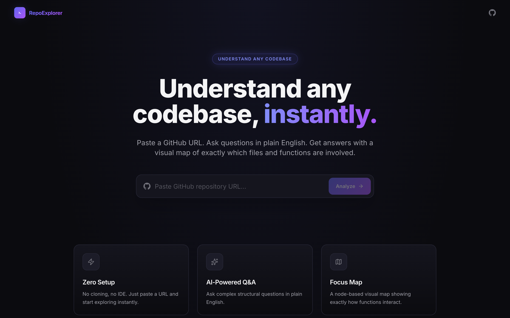
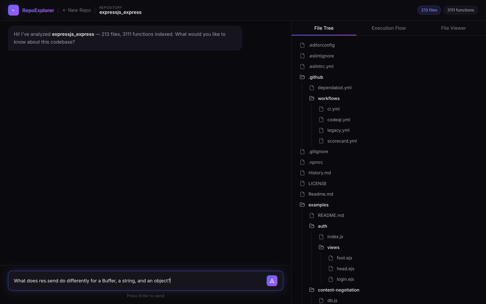
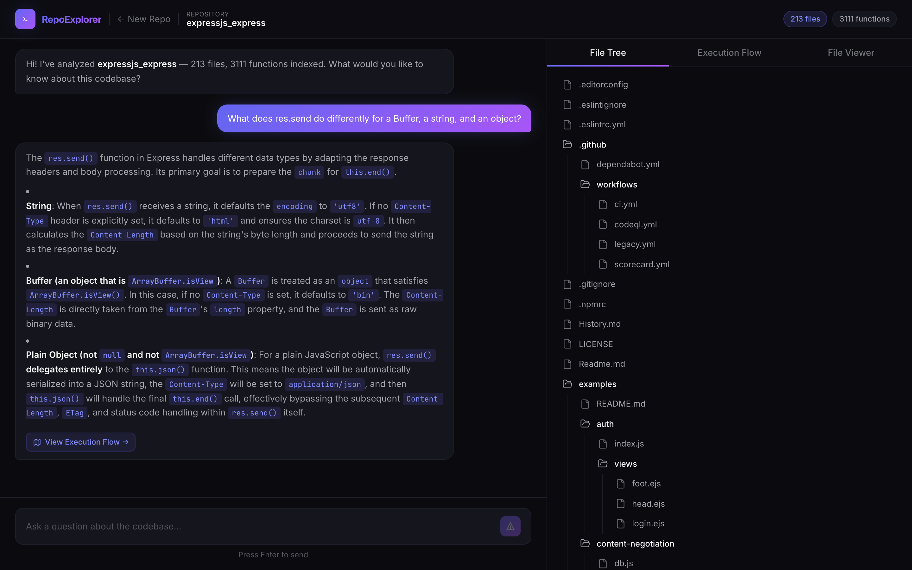
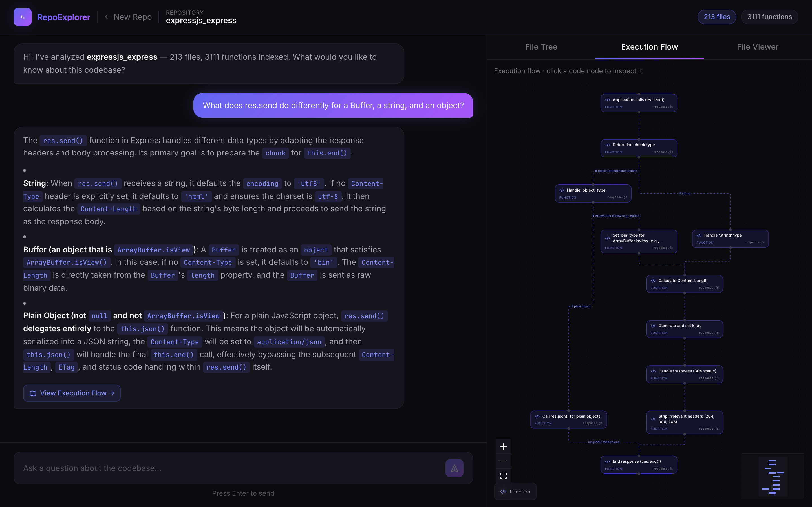
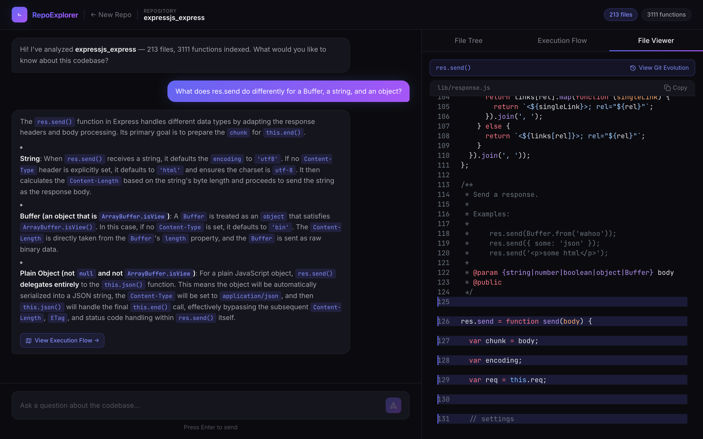
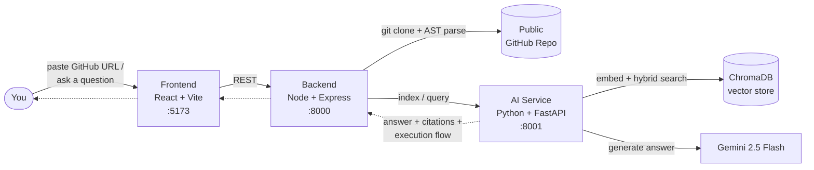

<div align="center">

# RepoExplorer

### Understand any codebase, instantly.

Paste a GitHub URL. Ask questions in plain English. Get answers with a visual map of exactly which files and functions are involved.


[Features](#features) • [Architecture](#architecture) • [Retrieval Benchmark](#retrieval-benchmark) • [Quick Start](#quick-start) • [API Reference](#api-reference)

</div>



## What it does

RepoExplorer clones a public GitHub repository, parses its AST to extract every function, and indexes them into a hybrid BM25 + vector search pipeline. Ask a question in plain English and it retrieves the exact functions that answer it, then asks Gemini 2.5 Flash to explain the *why* — grounded in real file paths, function names, and line numbers, with an auto-generated execution-flow diagram and per-function Git history.

No IDE, no cloning to your machine, no manually grepping through an unfamiliar codebase.

## Features

### Ask questions, get grounded answers

Every answer cites the exact files and functions it's grounded in — click any citation to jump straight to that code.




### Focus Map — see the execution flow, not just a file list

Every answer comes with an auto-generated, node-based diagram of the actual runtime path — user action → API endpoint → functions → output — built with React Flow and laid out automatically with Dagre.



### Jump straight to the code

Click a citation or a flow node and the File Viewer scrolls to and highlights the exact lines, with full syntax highlighting via Shiki.



### Git Evolution — how did this function get here?

Pick any cited function and see its real commit history, diffed line-by-line, with an AI-generated summary of how and why it changed.


## Retrieval Benchmark

The core retrieval claim — that hybrid BM25 + vector search beats pure vector search for code — is backed by a real, reproducible eval, not a guess:

| Method | Hit@5 | MRR@5 |
|---|---|---|
| **Hybrid (BM25 + vector, RRF-merged)** | **65%** (13/20) | **0.500** |
| Pure vector (MiniLM cosine similarity) | 40% (8/20) | 0.375 |

**Methodology:** 20 hand-written, purely conceptual questions about real functions in [`expressjs/express`](https://github.com/expressjs/express) (`lib/*.js`) — none of them name the target function or file, so this measures genuine semantic retrieval rather than keyword matching. Ground truth is the exact chunk containing the answer; the metric is whether it lands in the top 5 results. Both methods were run against the same indexed ChromaDB collection, using the app's actual production retrieval code (`service/vector_store.py`).

Why hybrid wins: pure embedding search misses exact identifiers and domain terms (`ETag`, `trust proxy`, specific header names) that BM25 catches, while vector search still handles paraphrased, non-literal questions BM25 alone would miss. Reciprocal Rank Fusion (k=60) merges both rankings without needing score normalization.

## Architecture

Three services, each with a single responsibility:



1. **Frontend** — paste a URL, chat with the codebase, explore the Focus Map, File Tree, and File Viewer.
2. **Backend** — clones the repo, extracts every function via Babel AST parsing, mines Git history, and proxies requests to the AI service.
3. **AI Service** — embeds functions with Gemini's `gemini-embedding-001` API, indexes them in ChromaDB, retrieves with hybrid BM25 + vector search, and calls Gemini 2.5 Flash to generate grounded, cited answers.

## Tech Stack

| Layer | Technologies |
|---|---|
| **Frontend** | React 19, Vite, Tailwind CSS, React Router, [React Flow](https://reactflow.dev/) + Dagre (Focus Map), Shiki (syntax highlighting), react-markdown |
| **Backend** | Node.js, Express 5, `simple-git`, `@babel/parser` + `@babel/traverse` (AST extraction), `express-rate-limit` |
| **AI Service** | Python, FastAPI, ChromaDB (persistent vector store), Gemini embedding API (`gemini-embedding-001`), `rank_bm25`, Google Generative AI SDK |
| **LLM** | Gemini 2.5 Flash |
| **Retrieval** | Hybrid BM25 + vector search, merged via Reciprocal Rank Fusion |

## Quick Start

**Prerequisites:** Node.js 18+, Python 3.10+, a [Gemini API key](https://ai.google.dev/).

```bash
git clone https://github.com/Sahil0282/repo-explorer.git
cd repo-explorer

# Install dependencies for all three services
npm install
npm install --prefix backend
npm install --prefix frontend
python3 -m venv service/venv && source service/venv/bin/activate && pip install -r service/requirements.txt
```

Configure environment variables:

```bash
# service/.env
GEMINI_API_KEY=your_api_key_here

# backend/.env
PORT=8000
CORS_ORIGIN=http://localhost:5173

# frontend/.env
VITE_API_URL=http://localhost:8000
```

Run it (two terminals):

```bash
# Terminal 1 — AI service (must run from service/ for the relative ChromaDB path)
cd service && source venv/bin/activate && uvicorn main:app --reload --port 8001

# Terminal 2 — backend + frontend together
npm run dev
```

Open **http://localhost:5173**, paste a public GitHub repo URL, and start asking questions.

> **Note:** the MVP caps analysis at 300 files per repo, and runs a single active analysis session at a time (older cloned repos are pruned automatically).

## API Reference

**Backend** (`http://localhost:8000/api/repo`)

| Method | Endpoint | Description |
|---|---|---|
| `POST` | `/analyze` | Clone a GitHub repo, extract functions, mine Git history, and index it |
| `POST` | `/query` | Ask a question; returns a cited answer + execution-flow graph |
| `GET` | `/file` | Fetch a file's raw content for the File Viewer |
| `GET` | `/evolution` | Get a function's commit history + AI-generated summary |
| `GET` | `/api/health` | Health check |

**AI Service** (`http://localhost:8001`)

| Method | Endpoint | Description |
|---|---|---|
| `POST` | `/index` | Embed and index extracted functions into ChromaDB |
| `POST` | `/query` | Hybrid BM25 + vector retrieval, then generate a Gemini answer |
| `POST` | `/evolution-summary` | Summarize a function's Git history with Gemini |
| `DELETE` | `/index/{repo_name}` | Force re-indexing of a repo |
| `GET` | `/health` | Health check |

## Project Structure

```
repo-explorer/
├── frontend/    # React + Vite — chat UI, Focus Map, File Viewer, Git Evolution
├── backend/     # Express — GitHub cloning, AST extraction, Git history mining
├── service/     # FastAPI — embeddings, ChromaDB, hybrid retrieval, Gemini
└── docs/        # Screenshots and other documentation assets
```

## Security

- CORS restricted to an explicit origin allowlist
- Tiered rate limiting: a global 100 req/min cap, plus stricter limits on `/analyze` (5 per 15 min) and `/query` (30/min)
- Path traversal protection on file reads (repo-relative paths only)
- Request body size caps
- GitHub URL validation via strict URL parsing (host must be exactly `github.com`)
